# tripwork

> 一個會「先查證、再排進行程」的旅遊規劃外掛（Claude Code plugin）。
> 每一個景點、餐廳、地址、營業時間、入境規定，都要先通過 **2 個以上獨立來源
> 交叉比對（至少 1 個當地語言）＋ 地圖座標落在正確區域** 才會被寫進你的行程。
> 不會給你過時、搬家、或網路謠傳的地點。

**目前版本：** 見 [CHANGELOG.md](CHANGELOG.md)。

---

## 這是給誰用的？

你**不需要會寫程式**。只要會在 Claude Code 裡打字，就能用一句話讓 tripwork
幫你排出一份「每個地點都查證過」的旅遊行程。

它特別適合：

- 想要一份**可信、不踩雷**的行程，而不是一堆過期的部落格連結
- 帶**長輩或小孩**，需要把同一區的景點排在一起、少拉車
- 不想自己一個個查**營業時間、要不要訂位、海關／行動電源規定**
- 想直接拿到 **Google Maps 連結**、給長輩看的 **LINE 純文字行程**，或寫回 **Notion**

---

## 它幫你解決什麼痛點

| 自己排行程的麻煩 | tripwork 怎麼處理 |
|---|---|
| 查到的店其實已經關了 / 搬家了 | 每個地點都要 ≥2 來源交叉比對 + 地圖座標確認，查不到就不放進行程 |
| 行程一天跑東跑西、長輩累垮 | 自動把同一區的景點分群，跨區拉車太遠會**停下來問你**要不要換 |
| 餐廳要訂位卻不知道 | 自動列出「出發前要先訂」的清單，連前置天數一起標出來 |
| 排到當地紅字假日，人爆多或店家沒開 | 自動查出旅遊期間的**當地國定假日（含補假）**：閉館日不排那個點、假期/週末日標人潮提示並建議提早出門、錯開脆弱小店 |
| 排太晚到，撲空或被趕（過了 L.O./最後入場）| 每個排定時段都對**閉店/最後點餐/最後入場**算 buffer：來不及的時段不排、buffer 太緊會提醒提早，必去點塞不下會**停下來問你** |
| 行動電源、入境規定看不懂、又怕過期 | 規定一律找**官方來源**、標註生效日期，被禁的項目會醒目提醒並要你確認 |
| 排好的行程要分享給家人很麻煩 | 一鍵輸出 Markdown（含地圖連結）、LINE 短文、離線可看的一頁式 HTML、Notion |
| 多點自駕每晚換鎮，住宿全空殼 | 每個過夜鎮都研究＋查證住宿（已訂的補料、沒訂的推薦你挑），顧到自駕車位、洗衣節奏、晚到 vs 櫃台關門 |
| 冬天自駕遇到道路封閉、雪鏈、天黑得早 | 用官方來源查季節/天氣危害：會擋路的（道路封閉）停下來問你，雪鏈／保暖寫進清單；自動算各鎮日落，摸黑開車的路段提醒你提早出發 |
| 多城行不知道搭哪班車、會不會趕不上末班車、Pass 划不划算 | 每段城際交通都查官方時刻：哪班車、要不要劃位、末班車幾點、Pass 划不划算；自駕單日開太久或趕不上末班車會停下來問你 |
| 不知道整趟大概多少錢、會不會超預算、Pass 划不划算 | 自動加總住宿＋城際交通＋Pass＋每日雜支，精算 Pass 划不划算，超出預算會停下來問你；全部誠實標為估算 |
| 帶長輩擠進尖峰電車、站走到景點太遠、不知道要不要買 IC 卡 | 查通勤尖峰時段（帶長輩/行李建議錯峰）、站到景點步行時間（太遠建議改計程車）、IC 卡怎麼買怎麼用，全寫進提醒 |

---

## 1. 快速開始

### 起手式（複製貼上就好）

裝好外掛後（見下方「安裝」），在 Claude Code 裡用**一句話**描述你的旅程即可：

```
用 tripwork 幫我排 3 天 2 夜東京自由行，有長輩，想去淺草寺和阿美橫町。
```

更多範例：

- `用 tripwork 排京都 2 天，想去伏見稲荷和嵐山竹林。`
- `用 tripwork 排沖繩家庭旅遊 4 天，有小孩，想要有海邊。`
- `用 tripwork 排大阪 3 天美食之旅，預算中等，住心齋橋附近。`

tripwork 接手後會**反問你缺的資訊**（日期、住哪、必去的點、預算、同行成員），
你照實回答即可，剩下的查證、分區、排程、輸出全部由它完成。途中遇到需要你
決定的地方（例如某個點太遠、餐廳要訂位、有被禁的物品）它**一定會停下來問你**，
不會自己亂改或偷偷拿掉你想去的點。

> 想要更聊天式的引導？若你同時裝了 `superpowers` 外掛，可以用
> `使用 superpowers:brainstorming 啟動 tripwork，我要排 <一句話>` 來開場，
> 它會更細地陪你釐清需求。非必要——直接打一句話也能跑。

### 安裝

tripwork 透過 marketplace 安裝。在 Claude Code 裡執行：

```bash
claude plugin marketplace add git@github.com:helping-ai-workflow/tripwork.git
claude plugin install tripwork
```

裝好後重開一個 Claude Code 對話，就能用上面的起手式開始排行程。

**前置需求：**

- **Claude Code**（桌面 App、CLI、或 IDE 外掛皆可）
- 規劃過程會用到 Claude Code 內建的**網路搜尋**（查證來源用）。
- 不需要任何 API key——地圖座標用免費的 OpenStreetMap Nominatim。

### 更新

```bash
claude plugin marketplace update tripwork && claude plugin install tripwork
```

---

## 2. 完整跑一次會發生什麼

tripwork 不是一次把行程「生」出來，而是一條**有關卡的流水線**：每一步只做一件事，
做完回到調度中心（orchestrator）決定下一步。這樣每個地點都被獨立查證，錯誤無法一路矇混到最後。

```mermaid
%%{init: {'flowchart':{'htmlLabels':true}}}%%
flowchart TB
    P["✍️ 你的一句話需求"]
    P --> WSP["workspace-shape-preflight<br/>確認工作資料夾"]
    WSP --> ORC["orchestrator<br/>調度中心"]
    ORC --> TB["trip-brief<br/>把需求整理成參數"]
    TB --> DR["destination-research<br/>廣泛蒐集候選地點<br/>（含當地語言搜尋）"]
    DR --> SV["source-verify ⛔ 關卡<br/>≥2 來源 + 地圖座標<br/>+ 區域比對"]
    SV --> RA["routing-audit<br/>同區分群<br/>算跨區拉車時間"]
    RA --> ACC["accommodation-research<br/>每個過夜鎮研究<br/>+ 查證住宿<br/>（設施/車位/洗衣）"]
    ACC --> LEG["inter-stop-legs<br/>城際交通<br/>（哪班車/末班車/Pass<br/>自駕單日車程）"]
    LEG --> CAL["calendar-check<br/>查旅遊期間當地假日<br/>（含補假）"]
    CAL --> SEA["seasonal-advisory<br/>查季節/天氣危害<br/>（道路封閉、雪鏈、日照）"]
    SEA --> TRN["transit-detail<br/>市內交通<br/>（尖峰時段/IC卡<br/>站到景點步行）"]
    TRN --> COST["cost-rollup<br/>加總住宿/交通/Pass<br/>+ 雜支，對照預算"]
    COST --> ADV["travel-advisory ⛔ 關卡<br/>入境／海關<br/>／行動電源規定<br/>（官方來源）"]
    ADV --> SYN["itinerary-synthesis<br/>排出逐日行程<br/>+ 備案 + 行前清單<br/>（閉館日不排、<br/>假期標人潮）"]
    SYN --> GATE["itinerary-gate<br/>輸出前的結構檢查"]
    GATE --> EXP["export-artifact<br/>Markdown / Maps<br/>HTML / LINE<br/>Notion"]
    EXP --> EGATE["export-gate ⛔ 關卡<br/>檢查成品連結<br/>格式可正常顯示"]
```



白話版每一步：

| 步驟 | 它在做什麼 |
|---|---|
| **trip-brief** | 把你說的話整理成日期、住宿、必去清單、預算、成員等參數 |
| **destination-research** | 廣泛上網蒐集候選景點／餐廳（**會用當地語言搜尋**，挖出國際網站漏掉的店）。此階段先不信任，只是蒐集 |
| **source-verify** ⛔ | **招牌關卡**。每個候選地點要：①≥2 個獨立來源（至少 1 個當地語言）②地圖能查到座標 ③座標落在它聲稱的區域內。三關都過才算「已驗證」，才能進行程 |
| **routing-audit** | 把已驗證地點按「區」分群，估算跨區移動時間；太遠（預設 >60 分）會**停下來問你** |
| **accommodation-research** | 每個過夜鎮研究／查證住宿：已訂的查證+補料，沒訂的推薦 3 家讓你挑；查不到座標用該鎮中心 fallback（免 API key）；確認車位（必備硬擋）、洗衣節奏（軟提示）、晚到 vs 櫃台關門 |
| **inter-stop-legs** | 規劃過夜城市之間的**城際交通**：大眾運輸查哪班車、要不要劃位、轉乘幾次、**末班車**幾點、要不要買 Pass；自駕算車程，**單日開太久**會停下來建議拆兩天。趕不上末班車也會停下來問你 |
| **calendar-check** | 用官方來源查出旅遊期間的**當地國定假日（含補假）**，標好哪幾天人潮／店家可能受影響 |
| **seasonal-advisory** | 查旅遊期間的**季節/天氣危害**（用官方來源：道路狀況、氣象、高山警告）：道路封閉這種會擋路的會停下來問你，雪鏈／保暖／日照短這種寫進行前清單；冬天自駕還會算每個鎮的日落時間，提醒哪段會摸黑開車要早點出發 |
| **transit-detail** | 查市內交通的**舒適度細節**：通勤**尖峰時段**（帶長輩/行李避開人擠人）、**IC 卡**（Suica/ICOCA 等，哪買怎麼儲值）、每個景點**從車站走過去要幾分鐘**（太遠提醒改計程車）。全是提醒，不擋流程 |
| **cost-rollup** | 把**大宗花費**加總給你看：住宿（每晚×晚數）、城際交通、交通 Pass，外加你給的每日雜支估值；精算 **Pass 到底划不划算**；有設預算的話，**超出會停下來問你**。全部標明是估算（含查詢日期），不是精確報價 |
| **travel-advisory** ⛔ | 查入境、海關、行動電源等**硬規定**，一律要官方來源並標生效日期；被禁項目醒目提醒並寫進行前清單（在排行程前先確認，禁帶品不會排進行程） |
| **itinerary-synthesis** | 排出逐日時段表，幫帶長輩／小孩的人把同區行程排在一起省體力；**閉館日不排該點、假期/週末標人潮並建議提早出門、過了閉店/L.O./最後入場的時段不排**；自動產生**備案**與**行前訂位清單** |
| **itinerary-gate** | 輸出前做機械式結構檢查（餐廳、活動、景點都有對應到驗證過的地點） |
| **export-artifact** | 產出成品：Markdown 行程（附 Google Maps 連結）、LINE 純文字、離線可看的一頁式 HTML（`exports/<slug>-itinerary.html`，**可選擇為景點疊上授權照片**）、可選 Notion |
| **export-gate** | 對輸出的 Markdown 成品做最後機械檢查：每個地點名稱本身是可點連結、要訂的項目附官方來源連結、金額不會把預覽弄壞（不殘留裸 `$`）；有問題就退回重產 |

---

## 3. 你會拿到什麼

- **Markdown 行程**——逐日時段表，**地點名稱本身就是 Google Maps 連結**（用當地語言店名，搭計程車／導航最準），**移動列另附「出發地 → 目的地」的路線導航連結**（開地圖直接帶路線，自己選開車或大眾運輸），要訂位／要買票的項目再附一條**官方來源連結**可一鍵查證或下單。
- **LINE 短文**——純文字、用 emoji 分段、不含網址，**長輩友善**，直接貼到家庭群組。
- **一頁式 HTML**——一個檔案、**離線就能看**的整趟行程網頁：漸層標題、行程總覽表、逐日卡片（**整齊三欄對齊：時間／說明／縮圖**，時段配色 + emoji、**住宿獨立成一張淺藍卡片**、當天備案收進說明欄的橘框），地點與移動列可點開地圖／路線導航、行前清單都在裡面，**大字 + 手機 RWD（長地圖連結不爆版）**，傳給長輩用瀏覽器打開就好。
- **景點示意照片（選用，預設不開）**——開啟照片功能後，行程裡的主要景點會附一張**授權清楚**的示意照片（來自 Wikimedia Commons／Openverse 等開放授權來源），照片下方**一定標出作者與授權、附原始連結**，點縮圖可放大看大圖（離線也能看）。只收**授權乾淨**的照片，不會用來路不明的圖；沒開啟時行程跟以前完全一樣。
- **住宿**——每個過夜鎮一家查證過的旅館（名稱即連結 + 官網／訂房連結），含價位帶、設施、車位確認。
- **城際交通**——每個移動日附上搭哪班車（要不要劃位、轉乘、車程）或自駕車程，含末班車與 Pass 提醒。
- **費用估算**——住宿＋城際交通＋Pass＋每日雜支的分類加總與總額，對照你的預算，附 Pass 划算與否；標明查詢日期，是估算而非報價。
- **市內交通提醒**——尖峰時段錯峰建議、站到景點步行時間（太遠提醒改計程車）、IC 卡怎麼買怎麼儲值，整理進行前清單。
- **行前清單**——所有需要提前訂位／辦理的事項，含前置天數；以及該季節要帶的東西（雪鏈、保暖）與摸黑開車提醒。
- **備案**——每個易出包的點（要訂位的餐廳、戶外活動）都附一個 plan B。
- **Notion（選用）**——若你的環境接了 Notion，會把行程寫回指定頁面；沒接也不會報錯，自動略過。

---

## 4. 招牌規則：先查證，再排進行程

tripwork 的核心是一條鐵律 **Source-Verified-First**：

> 沒有任何景點、餐廳、地址、營業時間或規定，能在「通過 ≥2 個獨立來源交叉比對
> （至少 1 個當地語言）＋ 地圖座標落在它聲稱的區域」之前，被寫進你的行程。

沒通過的地點**不會被偷偷丟掉**——它們會被記下來並標明原因（來源不足／查無座標／
座標跑到別區／來源彼此矛盾），讓你看得到、也能自己決定。

### 它什麼時候會停下來問你

這些情況 tripwork **一定會停下來**，不會自作主張：

- 不同來源對同一個點**講法矛盾**（評分／營業時間／地址不一致）→ 問你信哪個
- 某個跨區移動**太遠**（超過你設定的上限，預設 60 分）→ 問你要保留還是換點
- 某家餐廳的**訂位時間來不及** → 提醒你
- 某項規定是**被禁止**的（例如某類行動電源）→ 要你明確確認
- 你**指定必去**的點，在所有可行日都**剛好公休** → 停下來問你怎麼調
- 你**指定必去**的點，**任何時段都來不及**在閉店/最後入場前完成 → 停下來問你怎麼調
- 你**指定必去**的點驗證失敗 → 直接告訴你，不會默默拿掉
- 某個過夜鎮你**還沒訂住宿** → 推薦 3 家查證過的讓你挑
- 你訂的旅館**缺必備設施**（例如自駕沒車位） → 停下來問你換不換
- 你訂的旅館**地圖座標落在別的鎮** → 停下來問你
- 開車當天**晚於旅館櫃台關門**又沒 late check-in → 停下來提醒你
- 某段路在你的旅遊期間**官方公告封閉**（例如雪季的高山公路） → 停下來問你怎麼調
- 冬天某段車程預計**天黑後才到** → 提醒你那天提早出發（不擋流程）
- 某段城際交通你會**趕不上末班車** → 停下來問你（提早出發／改隔天／換交通方式）
- 某段自駕**單日開太久**（超過你設定的上限，預設 5 小時） → 停下來建議你拆兩天
- 估算總額**超出你設定的預算** → 停下來問你（刪減／降級某項，或接受）

---

## 5. 實測範例（這份 README 附帶的真實試跑）

下面兩個案例是用 tripwork 的查證／路線邏輯，搭配**即時地圖座標**實際跑出來的，
用來證明流程會產出合理的行程、而且關卡真的會擋。

### 案例 A — 東京 3 天 2 夜（帶長輩，住淺草）

5 個候選地點全部成功查到座標、且落在正確的區（台東区）：

| 地點 | 區域 | 座標查證 |
|---|---|---|
| 浅草寺 | 淺草 | ✅ 35.713, 139.796 |
| 仲見世通り | 淺草 | ✅ 35.713, 139.797 |
| 上野恩賜公園 | 上野 | ✅ 35.715, 139.774 |
| 東京国立博物館 | 上野 | ✅ 35.719, 139.776 |
| アメ横（阿美橫町） | 上野 | ✅ 35.710, 139.775 |

- 淺草 ↔ 上野直線僅 **1.97 km**，地鐵約 15 分 → 判定 `ok`。
- 分成「淺草日」與「上野日」兩群，**同區排在一起**，帶長輩不用來回拉車 → 合理。

### 案例 B — 京都 2 天（伏見稲荷 + 嵐山竹林）

關卡如預期觸發：

- 伏見稲荷 ↔ 嵐山直線 **11.30 km**，搭 JR 需在京都站轉車，門到門實測約 **65 分**
  → 超過 60 分上限，判定 `far` → **tripwork 會停下來問你**要不要保留兩點或調整，
  不會默默排一個讓你當天疲於奔命的行程。✅ 安全機制有效。
- 另外發現一個實用細節：地圖查座標要用**當地語言店名**（`渡月橋` 查得到、
  英文 `Togetsukyo Bridge` 加了 "Bridge" 反而查不到）。tripwork 的 export 與查證
  都以當地語言店名為準，正是為此。

> 結論：流程跑得通，行程合理，且「太遠就停下來問」的安全閥確實會作動。

---

## 常見問題

**要付費或申請 API key 嗎？**
不用。地圖座標用免費的 OpenStreetMap Nominatim；網路搜尋用 Claude Code 內建功能。

**它會不會自己亂編地點？**
不會。沒通過查證關卡的地點進不了行程，且會被標明原因留存，不會假裝成「已驗證」。

**支援哪些目的地？**
任何地方都可以——只要該地點在網路上有 ≥2 個來源、且地圖查得到座標。會自動用
當地語言搜尋，所以日本、韓國、東南亞等地的在地小店也涵蓋得到。

**Notion 沒接會怎樣？**
其他輸出（Markdown／LINE）照常產生，Notion 那一步自動略過、不會讓整個流程失敗。

**我可以中途改需求嗎？**
可以。每個階段的產物都是檔案，調度中心會從你改動的地方接續往下跑，不用整個重來。

---

## 開發者資訊

<details>
<summary><b>本機開發與測試</b></summary>

```bash
pip install -e ".[dev]"
pytest                 # 599 個測試
```

- 流水線由 `skills/` 下的 16 個 skill 組成，全程由 `orchestrator` 調度。
- 純邏輯（查證三關、路線分類、距離、各種 render）在 `scripts/`，皆有單元測試。
- Schema 定義在 `schemas/`；端到端 fixture 在 `tests/`。
- **景點照片（選用）：** 可插拔 photo adapter（`scripts/photo_adapter.py`，backend `none`（預設）／`wiki`／`google`）抓開放授權景點照，硬性 license 白名單 `{CC0, PD, CC-BY, CC-BY-SA}`（拒 NC／ND）、附描述性 User-Agent 與每來源節流。照片存在側檔 `verified-pois-media.yaml`（schema `schemas/verified-pois-media.schema.json`），輸出時由 `scripts/media_merge.py` 疊回 poi_map，**不寫進** canonical `verified-pois.yaml`（source-verify 會整檔覆寫）。`export-gate` 會擋掉不安全的 ``（只允許 `data:image/` 或 `https://`）、沒有署名的照片、以及 `photo_source=google` 這種不可散布來源。`google` backend 因 ToS（無非 Google 介面顯示授權、無個人快取例外）**BLOCKED**。POI schema 的 `gmaps_place_id` 讓 Maps 連結可用 `&query_place_id` 深連到指定地點。
- **移動列路線導航 + 內容衛生 gate（v0.19.0）：** itinerary schema 的 row 可選帶 `from`/`to`（移動列端點，向後相容；`additionalProperties:false` 仍擋未知 key），`scripts/render/gmaps_links.py:dir_url` 產生 `maps/dir/?api=1&origin=…&destination=…`（**不帶** `travelmode`，由使用者選開車／大眾運輸），HTML／Markdown 的地圖 chip 都移到說明開頭（slot emoji + 名稱／A→B）。`export-gate` 新增 `no_internal_jargon` 檢查，擋掉漏進使用者文案的內部 `(poi-id)` token 與 `must_do`（依權威 id 集合比對 → 零誤報；連 Markdown 的 `\_` 跳脫也照抓）。**已知待辦：** `scripts/render/line_short.py` 目前無 gate，其 `must_do`／`(poi-id)` 洩漏需另開 `run_line_gate`，列為獨立工項。

**地圖座標用量限制：** 使用 OSM Nominatim（免 API key），請遵守其使用政策
（≤ 1 req/s、帶 User-Agent）。`scripts/geocode.py` 已設好 User-Agent，呼叫端負責節流。
`resolve_place` 的查詢會以**每趟快取**（`work/<slug>/geocode-cache/`，連查無結果也快取）
減少 re-run 時的重複 Nominatim 呼叫。

</details>

## 授權

[MIT](LICENSE)
