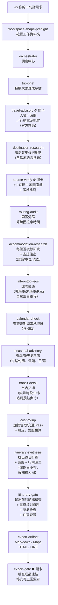

# tripwork

> 一個會「先查證、再排進行程」的旅遊規劃外掛（Claude Code plugin）。
> 每一個景點、餐廳、地址、營業時間、入境規定，都要先通過 **2 個以上獨立來源
> 交叉比對（至少 1 個當地語言）＋ 地圖座標落在正確區域** 才會被寫進你的行程。
> 不會給你過時、搬家、或網路謠傳的地點。

**目前版本：** 見 [CHANGELOG.md](CHANGELOG.md)。

---

## 這是給誰用的？

你**不需要會寫程式**。只要會在 Claude Code 裡打字，就能用一句話讓 tripwork
幫你排出一份「每個地點都查證過」的旅遊行程。

它特別適合：

- 想要一份**可信、不踩雷**的行程，而不是一堆過期的部落格連結
- 帶**長輩或小孩**，需要把同一區的景點排在一起、少拉車
- 不想自己一個個查**營業時間、要不要訂位、海關／行動電源規定**
- 想直接拿到 **Google Maps 連結**、給長輩看的 **LINE 純文字行程**，或貼進 **Notion**

---

## 它幫你解決什麼痛點

| 自己排行程的麻煩 | tripwork 怎麼處理 |
|---|---|
| 查到的店其實已經關了 / 搬家了 | 每個地點都要 ≥2 來源交叉比對 + 地圖座標確認，查不到就不放進行程 |
| 行程一天跑東跑西、長輩累垮 | 自動把同一區的景點分群，跨區拉車太遠會**停下來問你**要不要換 |
| 餐廳要訂位卻不知道 | 自動列出「出發前要先訂」的清單，連前置天數一起標出來 |
| 排到當地紅字假日，人爆多或店家沒開 | 自動查出旅遊期間的**當地國定假日（含補假）**：閉館日不排那個點、假期/週末日標人潮提示並建議提早出門、錯開脆弱小店 |
| 排太晚到，撲空或被趕（過了 L.O./最後入場）| 每個排定時段都對**閉店/最後點餐/最後入場**算 buffer：來不及的時段不排、buffer 太緊會提醒提早，必去點塞不下會**停下來問你** |
| 行動電源、入境規定看不懂、又怕過期 | 規定一律找**官方來源**、標註生效日期，被禁的項目會醒目提醒並要你確認 |
| 排好的行程要分享給家人很麻煩 | 一鍵輸出 Markdown（含地圖連結）、LINE 短文、離線可看的一頁式 HTML（可貼進 Notion）|
| 多點自駕每晚換鎮，住宿全空殼 | 每個過夜鎮都研究＋查證住宿（已訂的補料、沒訂的推薦你挑），顧到自駕車位、洗衣節奏、晚到 vs 櫃台關門 |
| 冬天自駕遇到道路封閉、雪鏈、天黑得早 | 用官方來源查季節/天氣危害：會擋路的（道路封閉）停下來問你，雪鏈／保暖寫進清單；自動算各鎮日落，摸黑開車的路段提醒你提早出發 |
| 多城行不知道搭哪班車、會不會趕不上末班車、Pass 划不划算 | 每段城際交通都查官方時刻：哪班車、要不要劃位、末班車幾點、Pass 划不划算；自駕單日開太久或趕不上末班車會停下來問你 |
| 不知道整趟大概多少錢、會不會超預算、Pass 划不划算 | 自動加總住宿＋城際交通＋Pass＋每日雜支，精算 Pass 划不划算，超出預算會停下來問你；全部誠實標為估算 |
| 帶長輩擠進尖峰電車、站走到景點太遠、不知道要不要買 IC 卡 | 查通勤尖峰時段（帶長輩/行李建議錯峰）、站到景點步行時間（太遠建議改計程車）、IC 卡怎麼買怎麼用，全寫進提醒 |

---

## 1. 快速開始

### 起手式（複製貼上就好）

裝好外掛後（見下方「安裝」），在 Claude Code 裡用**一句話**描述你的旅程即可：

```
用 tripwork 幫我排 3 天 2 夜東京自由行，有長輩，想去淺草寺和阿美橫町。
```

更多範例：

- `用 tripwork 排京都 2 天，想去伏見稲荷和嵐山竹林。`
- `用 tripwork 排沖繩家庭旅遊 4 天，有小孩，想要有海邊。`
- `用 tripwork 排大阪 3 天美食之旅，預算中等，住心齋橋附近。`

tripwork 接手後會**反問你缺的資訊**（日期、住哪、必去的點、預算、同行成員），
你照實回答即可，剩下的查證、分區、排程、輸出全部由它完成。途中遇到需要你
決定的地方（例如某個點太遠、餐廳要訂位、有被禁的物品）它**一定會停下來問你**，
不會自己亂改或偷偷拿掉你想去的點。

> 想要更聊天式的引導？若你同時裝了 `superpowers` 外掛，可以用
> `使用 superpowers:brainstorming 啟動 tripwork，我要排 <一句話>` 來開場，
> 它會更細地陪你釐清需求。非必要——直接打一句話也能跑。

### 安裝

tripwork 透過 marketplace 安裝。在 Claude Code 裡執行：

```bash
claude plugin marketplace add git@github.com:helping-ai-workflow/tripwork.git
claude plugin install tripwork
```

裝好後重開一個 Claude Code 對話，就能用上面的起手式開始排行程。

**前置需求：**

- **Claude Code**（桌面 App、CLI、或 IDE 外掛皆可）
- 規劃過程會用到 Claude Code 內建的**網路搜尋**（查證來源用）。
- 不需要任何 API key——地圖座標用免費的 OpenStreetMap Nominatim。

### 更新

```bash
claude plugin marketplace update tripwork && claude plugin install tripwork
```

<details>
<summary>其他 AI agent 安裝（Cursor / Codex / Kimi / Gemini / OpenCode / Pi）</summary>

| Agent | 安裝 |
|---|---|
| Cursor / Codex / Kimi | 用各自的 plugin marketplace 加 `git@github.com:helping-ai-workflow/tripwork.git`，再 install `tripwork` |
| Gemini CLI | `gemini extensions install https://github.com/helping-ai-workflow/tripwork` |
| OpenCode | `opencode.json` 的 `plugin` 陣列加 `"tripwork@git+https://github.com/helping-ai-workflow/tripwork.git"`（見 `.opencode/INSTALL.md`） |
| Pi | `pi install git:github.com/helping-ai-workflow/tripwork` |

每個 agent 都會在 session 開始自動載入 `using-tripwork`，行為與 Claude Code 一致。
</details>

---

## 2. 完整跑一次會發生什麼

tripwork 不是一次把行程「生」出來，而是一條**有關卡的流水線**：每一步只做一件事，
做完回到調度中心（orchestrator）決定下一步。這樣每個地點都被獨立查證，錯誤無法一路矇混到最後。


```mermaid
%%{init: {'flowchart':{'htmlLabels':true}}}%%
flowchart TB
    P["✍️ 你的一句話需求"]
    P --> WSP["workspace-shape-preflight<br/>確認工作資料夾"]
    WSP --> ORC["orchestrator<br/>調度中心"]
    ORC --> TB["trip-brief<br/>把需求整理成參數"]
    TB --> ADV["travel-advisory ⛔ 關卡<br/>入境／海關<br/>／行動電源規定<br/>（官方來源）"]
    ADV --> DR["destination-research<br/>廣泛蒐集候選地點<br/>（含當地語言搜尋）"]
    DR --> SV["source-verify ⛔ 關卡<br/>≥2 來源 + 地圖座標<br/>+ 區域比對"]
    SV --> RA["routing-audit<br/>同區分群<br/>算跨區拉車時間"]
    RA --> ACC["accommodation-research<br/>每個過夜鎮研究<br/>+ 查證住宿<br/>（設施/車位/洗衣）"]
    ACC --> LEG["inter-stop-legs<br/>城際交通<br/>（哪班車/末班車/Pass<br/>自駕單日車程）"]
    LEG --> CAL["calendar-check<br/>查旅遊期間當地假日<br/>（含補假）"]
    CAL --> SEA["seasonal-advisory<br/>查季節/天氣危害<br/>（道路封閉、雪鏈、日照）"]
    SEA --> TRN["transit-detail<br/>市內交通<br/>（尖峰時段/IC卡<br/>站到景點步行）"]
    TRN --> COST["cost-rollup<br/>加總住宿/交通/Pass<br/>+ 雜支，對照預算"]
    COST --> SYN["itinerary-synthesis<br/>排出逐日行程<br/>+ 備案 + 行前清單<br/>（閉館日不排、<br/>假期標人潮）"]
    SYN --> GATE["itinerary-gate<br/>輸出前的結構檢查<br/>+ 重算核對資料<br/>+ 語氣檢查<br/>+ 住宿查證"]
    GATE --> EXP["export-artifact<br/>Markdown / Maps<br/>HTML / LINE"]
    EXP --> EGATE["export-gate ⛔ 關卡<br/>檢查成品連結<br/>格式可正常顯示"]
```

白話版每一步：

| 步驟 | 它在做什麼 |
|---|---|
| **trip-brief** | 把你說的話整理成日期、住宿、必去清單、預算、成員等參數 |
| **travel-advisory** ⛔ | 查入境、海關、行動電源等**硬規定**，一律要官方來源並標生效日期；被禁項目醒目提醒並寫進行前清單（在蒐集景點前先確認，被禁項目不會浪費後面的研究） |
| **destination-research** | 廣泛上網蒐集候選景點／餐廳（**會用當地語言搜尋**，挖出國際網站漏掉的店）。此階段先不信任，只是蒐集 |
| **source-verify** ⛔ | **招牌關卡**。每個候選地點要：①**還在營業**（永久／暫停營業的會被擋掉；營業狀態一定要附**查證來源與日期**，不是憑印象打勾就算——查不到有來源根據的營業狀態一樣標未驗證、不放進行程）②≥2 個獨立來源（至少 1 個當地語言）③地圖能查到座標、且查到的就是它本人（被改名的鄰店會被擋）④座標落在它聲稱的區域內、**且座標的來源要記錄下來**（沒記來源一樣視為未驗證，不會因為漏填就矇混過關）。全部過才算「已驗證」，才能進行程 |
| **routing-audit** | 把已驗證地點按「區」分群，估算跨區移動時間；太遠（預設 >60 分）會**停下來問你** |
| **accommodation-research** | 每個過夜鎮研究／查證住宿：已訂的查證+補料，沒訂的推薦 3 家讓你挑；查不到座標用該鎮中心 fallback（免 API key）；確認車位（必備硬擋）、洗衣節奏（軟提示）、晚到 vs 櫃台關門；日文假名旅館名附中文對照 |
| **inter-stop-legs** | 規劃過夜城市之間的**城際交通**：大眾運輸查哪班車、要不要劃位、轉乘幾次、**末班車**幾點、要不要買 Pass；自駕算車程，**單日開太久**會停下來建議拆兩天。趕不上末班車也會停下來問你 |
| **calendar-check** | 用官方來源查出旅遊期間的**當地國定假日（含補假）**，標好哪幾天人潮／店家可能受影響 |
| **seasonal-advisory** | 查旅遊期間的**季節/天氣危害**（用官方來源：道路狀況、氣象、高山警告）：道路封閉這種會擋路的會停下來問你，雪鏈／保暖／日照短這種寫進行前清單；冬天自駕還會算每個鎮的日落時間，提醒哪段會摸黑開車要早點出發 |
| **transit-detail** | 查市內交通的**舒適度細節**：通勤**尖峰時段**（帶長輩/行李避開人擠人）、**IC 卡**（Suica/ICOCA 等，哪買怎麼儲值）、每個景點**從車站走過去要幾分鐘**（太遠提醒改計程車）。全是提醒，不擋流程 |
| **cost-rollup** | 把**大宗花費**加總給你看：住宿（每晚×**房數**×晚數）、城際交通、交通 Pass，外加你給的每日雜支估值；精算 **Pass 到底划不划算**；有設預算的話，**超出會停下來問你**（預算對照的是整趟總額：住宿＋交通＋雜支）。全部標明是估算（含查詢日期），不是精確報價 |
| **itinerary-synthesis** | 排出逐日時段表，幫帶長輩／小孩的人把同區行程排在一起省體力；**閉館日不排該點、假期/週末標人潮並建議提早出門、過了閉店/L.O./最後入場的時段不排**；自動產生**備案**與**行前訂位清單** |
| **itinerary-gate** | 輸出前做機械式結構檢查（餐廳、活動、景點都有對應到驗證過的地點）。**現在還會**：①把路線時間、花費、關店 buffer 這些數字**重新算一遍**，跟行程裡記錄的核對是否一致，兜不起來就擋下來 ②檢查文案**有沒有 AI 罐頭味**（例如「首選必訪」這種空話、破折號濫用）③連**住宿**的查證狀態（名字有沒有對到、座標有沒有查證來源）也一起核對，不再只查景點 ④**景點與住宿的「已驗證」是不是用現在還算數的規則判定的**——例如營業狀態只是隨口打勾、沒有查證來源與日期，就算當初有記錄，現在也會被判定過時、擋下來重新查證 |
| **export-artifact** | 產出成品：Markdown 行程（附 Google Maps 連結）、LINE 純文字、離線可看的一頁式 HTML（`exports/<slug>-itinerary.html`，**可選擇為景點疊上授權照片**——照片來源現在全程都會過一次授權檢查才寫入成品，不會有漏網的來路不明照片；可把 Markdown 貼進 Notion）|
| **export-gate** | 對輸出的 Markdown 成品做最後機械檢查：每個地點名稱本身是可點連結、**每個 Google Maps 連結都能正常打開（擋掉會失效、打不開的地圖連結）**、要訂的項目附官方來源連結、金額不會把預覽弄壞（不殘留裸 `$`）；有問題就退回重產 |

---

## 3. 你會拿到什麼

- **Markdown 行程**——逐日時段表，**地點名稱本身就是 Google Maps 連結**（用當地語言店名，搭計程車／導航最準；查得到 Google place_id 的會直接帶你開到那一家店，不再只是名稱搜尋），**移動列另附「出發地 → 目的地」的路線導航連結**（開地圖直接帶路線，自己選開車或大眾運輸），要訂位／要買票的項目再附一條**官方來源連結**可一鍵查證或下單。
- **LINE 短文**——純文字、用 emoji 分段、不含網址，**長輩友善**，直接貼到家庭群組。
- **一頁式 HTML**——一個檔案、**離線就能看**的整趟行程網頁：漸層標題、行程總覽表、逐日卡片（**整齊三欄對齊：時間／說明／縮圖**，時段配色 + emoji、**住宿獨立成一張淺藍卡片**、當天備案收進說明欄的橘框），地點與移動列可點開地圖／路線導航、行前清單都在裡面，**大字 + 手機 RWD（長地圖連結不爆版）**，傳給長輩用瀏覽器打開就好。
- **景點示意照片（選用，預設不開）**——開啟照片功能後，行程裡的主要景點會附一張**授權清楚**的示意照片（來自 Wikimedia Commons／Openverse 等開放授權來源），照片下方**一定標出作者與授權、附原始連結**，點縮圖可放大看大圖（離線也能看）。只收**授權乾淨**的照片，不會用來路不明的圖；沒開啟時行程跟以前完全一樣。
- **住宿**——每個過夜鎮一家查證過的旅館（名稱即連結 + 官網／訂房連結），含價位帶、設施、車位確認。
- **城際交通**——每個移動日附上搭哪班車（要不要劃位、轉乘、車程）或自駕車程，含末班車與 Pass 提醒。
- **費用估算**——住宿＋城際交通＋Pass＋每日雜支的分類加總與總額，對照你的預算，附 Pass 划算與否；標明查詢日期，是估算而非報價。
- **市內交通提醒**——尖峰時段錯峰建議、站到景點步行時間（太遠提醒改計程車）、IC 卡怎麼買怎麼儲值，整理進行前清單。
- **行前清單**——所有需要提前訂位／辦理的事項，含前置天數；以及該季節要帶的東西（雪鏈、保暖）與摸黑開車提醒。
- **備案**——每個易出包的點（要訂位的餐廳、戶外活動）都附一個 plan B。
- **貼進 Notion（選用）**——想放 Notion 的話，把產好的 Markdown 行程貼進 Notion 頁面即可（透過你環境的 Notion MCP）；內容就是那份已驗證的 Markdown，不是另一個獨立輸出。

---

## 4. 招牌規則：先查證，再排進行程

tripwork 的核心是一條鐵律 **Source-Verified-First**：

> 沒有任何景點、餐廳、地址、營業時間或規定，能在「**仍在營業** ＋ 通過 ≥2 個獨立
> 來源交叉比對（至少 1 個當地語言）＋ 地圖座標落在它聲稱的區域（且查到的就是它本人）」
> 之前，被寫進你的行程。

沒通過的地點**不會被偷偷丟掉**——它們會被記下來並標明原因（已歇業／查不到營業狀態／
來源不足／查無座標／查到的是別家店／座標跑到別區／來源彼此矛盾），讓你看得到、也能
自己決定。

### 它什麼時候會停下來問你

這些情況 tripwork **一定會停下來**，不會自作主張：

- 不同來源對同一個點**講法矛盾**（評分／營業時間／地址不一致）→ 問你信哪個
- 某個跨區移動**太遠**（超過你設定的上限，預設 60 分）→ 問你要保留還是換點
- 某個跨區移動的**預估時間不合理**（比實際距離所需的最短時間還短，例如硬說走路 10 分鐘能到 10 公里外）→ 停下來要你補一個真的來源（路線引擎查詢或時刻表），不會自己把猜測的數字往上調就蒙混過關
- 某家餐廳的**訂位時間來不及** → 提醒你
- 某項規定是**被禁止**的（例如某類行動電源）→ 要你明確確認
- 你**指定必去**的點，在所有可行日都**剛好公休** → 停下來問你怎麼調
- 你**指定必去**的點，**任何時段都來不及**在閉店/最後入場前完成 → 停下來問你怎麼調
- 你**指定必去**的點驗證失敗 → 直接告訴你，不會默默拿掉
- 某個過夜鎮你**還沒訂住宿** → 推薦 3 家查證過的讓你挑
- 你訂的旅館**缺必備設施**（例如自駕沒車位） → 停下來問你換不換
- 你訂的旅館**地圖座標落在別的鎮** → 停下來問你
- 你訂的旅館**名字或座標查不到可信來源、或營業狀態沒有來源與日期** → 跟景點用同一套查證標準（含「還在營業」這一項），查不到來源一樣視為未驗證並提醒你
- 景點或住宿的「已驗證」其實是**用舊規則判定出來的**（例如營業狀態只是隨口打勾、沒有查證來源與日期）→ 品質關卡會擋下來，自動導回去補查證，不會讓過時的驗證結果矇混過關
- 開車當天**晚於旅館櫃台關門**又沒 late check-in → 停下來提醒你
- 某段路在你的旅遊期間**官方公告封閉**（例如雪季的高山公路） → 停下來問你怎麼調
- 冬天某段車程預計**天黑後才到** → 提醒你那天提早出發（不擋流程）
- 某段城際交通你會**趕不上末班車** → 停下來問你（提早出發／改隔天／換交通方式）
- 某段自駕**單日開太久**（超過你設定的上限，預設 5 小時） → 停下來建議你拆兩天
- 估算總額**超出你設定的預算** → 停下來問你（刪減／降級某項，或接受）
- 用**比較舊的行程資料夾**接續排（例如中途換過版本、缺了路線／交通／花費檔案）→ 輸出前的品質關卡現在會直接擋下來，不會像以前一樣默默放行；系統會自動導回該補的那一站幫你重新查（路線／交通／花費），不用你自己猜要重跑哪一步

---

## 5. 實測範例（這份 README 附帶的真實試跑）

下面兩個案例是用 tripwork 的查證／路線邏輯，搭配**即時地圖座標**實際跑出來的，
用來證明流程會產出合理的行程、而且關卡真的會擋。

### 案例 A — 東京 3 天 2 夜（帶長輩，住淺草）

5 個候選地點全部成功查到座標、且落在正確的區（台東区）：

| 地點 | 區域 | 座標查證 |
|---|---|---|
| 浅草寺 | 淺草 | ✅ 35.713, 139.796 |
| 仲見世通り | 淺草 | ✅ 35.713, 139.797 |
| 上野恩賜公園 | 上野 | ✅ 35.715, 139.774 |
| 東京国立博物館 | 上野 | ✅ 35.719, 139.776 |
| アメ横（阿美橫町） | 上野 | ✅ 35.710, 139.775 |

- 淺草 ↔ 上野直線僅 **1.97 km**，地鐵約 15 分 → 判定 `ok`。
- 分成「淺草日」與「上野日」兩群，**同區排在一起**，帶長輩不用來回拉車 → 合理。

### 案例 B — 京都 2 天（伏見稲荷 + 嵐山竹林）

關卡如預期觸發：

- 伏見稲荷 ↔ 嵐山直線 **11.30 km**，搭 JR 需在京都站轉車，門到門實測約 **65 分**
  → 超過 60 分上限，判定 `far` → **tripwork 會停下來問你**要不要保留兩點或調整，
  不會默默排一個讓你當天疲於奔命的行程。✅ 安全機制有效。
- 另外發現一個實用細節：地圖查座標要用**當地語言店名**（`渡月橋` 查得到、
  英文 `Togetsukyo Bridge` 加了 "Bridge" 反而查不到）。tripwork 的 export 與查證
  都以當地語言店名為準，正是為此。

> 結論：流程跑得通，行程合理，且「太遠就停下來問」的安全閥確實會作動。

---

## 常見問題

**要付費或申請 API key 嗎？**
不用。地圖座標用免費的 OpenStreetMap Nominatim；網路搜尋用 Claude Code 內建功能。

**它會不會自己亂編地點？**
不會。沒通過查證關卡的地點進不了行程，且會被標明原因留存，不會假裝成「已驗證」。

**支援哪些目的地？**
任何地方都可以——只要該地點在網路上有 ≥2 個來源、且地圖查得到座標。會自動用
當地語言搜尋，所以日本、韓國、東南亞等地的在地小店也涵蓋得到。

**怎麼放進 Notion？**
把產好的 Markdown 行程貼進 Notion 頁面就好（透過你環境的 Notion MCP）。Notion 不是獨立的輸出步驟，貼的就是那份已驗證的 Markdown。

**我可以中途改需求嗎？**
可以。每個階段的產物都是檔案，調度中心會從你改動的地方接續往下跑，不用整個重來。

---

## 開發者資訊

<details>
<summary><b>本機開發與測試</b></summary>

```bash
pip install -e ".[dev]"
pytest                 # CI（無消費端語料）全數通過，另有一批 corpus-gated guard 被 skip（見上）
                        # ——確切通過數隨測試增減，不在這裡釘死，直接跑 pytest 看數字
```

- 流水線由 `skills/` 下的 16 個 skill 組成，全程由 `orchestrator` 調度。
- 純邏輯（查證三關、路線分類、距離、各種 render）在 `scripts/`，皆有單元測試。
- Schema 定義在 `schemas/`；端到端 fixture 在 `tests/`。
- **景點照片（選用）：** 可插拔 photo adapter（`scripts/photo_adapter.py`，backend `none`（預設）／`wiki`／`google`）抓開放授權景點照，硬性 license 白名單 `{CC0, PD, CC-BY, CC-BY-SA}`（拒 NC／ND）、附描述性 User-Agent 與每來源節流。照片存在側檔 `verified-pois-media.yaml`（schema `schemas/verified-pois-media.schema.json`），輸出時由 `scripts/media_merge.py` 疊回 poi_map，**不寫進** canonical `verified-pois.yaml`（source-verify 會整檔覆寫）。`export-gate` 會擋掉不安全的 ``（只允許 `data:image/` 或 `https://`）、沒有署名的照片、以及 `photo_source=google` 這種不可散布來源。`google` backend 因 ToS（無非 Google 介面顯示授權、無個人快取例外）標為不可散布。POI schema 的 `gmaps_place_id` 讓 Maps 連結用 canonical `maps/place/?q=place_id:<id>` 直接深連到那一家店（P9）。
- **移動列路線導航 + 內容衛生 gate（v0.19.0）：** itinerary schema 的 row 可選帶 `from`/`to`（移動列端點，向後相容；`additionalProperties:false` 仍擋未知 key），`scripts/render/gmaps_links.py:dir_url` 產生 `maps/dir/?api=1&origin=…&destination=…`（**不帶** `travelmode`，由使用者選開車／大眾運輸），HTML／Markdown 的地圖 chip 都移到說明開頭（slot emoji + 名稱／A→B）。`export-gate` 新增 `no_internal_jargon` 檢查，擋掉漏進使用者文案的內部 `(poi-id)` token 與 `must_do`（依權威 id 集合比對 → 零誤報；連 Markdown 的 `\_` 跳脫也照抓）。
- **內容衛生移到 canonical 層（v0.20.0）：** jargon（`(poi-id)`／`must_do`）+ 日文 kana-gloss 兩個檢查移進 `scripts/gate.py::run_gate`（掃 `_itinerary_text`＝checklist＋每列 row text），共用 `scripts/text_hygiene.py`。這是**主**防線：在 canonical 層擋掉，md／html／LINE／貼進 Notion 的 md 全在源頭乾淨（含本來無 gate 的 `line_short.py`）——解掉 v0.19.0 列的 line_short 待辦。`export-gate` 的 md／html 檢查保留為 defense-in-depth。Notion 不再是獨立 adapter（貼已驗證的 md 即可）。
- **kana 地點名強制中文 gloss（v0.21.0）：** `verify_status: verified` 且 `name_display` 含 kana（`[぀-ヿ]`）的 POI **必須**有非空 `name_zh`（地圖連結 label 才會顯示成 `name_display（name_zh）`、中文讀者讀得懂）。`itinerary-gate` 新增 `referenced_pois_glossed` check（`scripts/gate.py` + `text_hygiene.kana_name_without_gloss`）＋ `verified-pois.schema.json` 的 `allOf` if/then 雙層把關。純漢字名（五稜郭）豁免、unverified 豁免（不會 render）。前瞻防護，現有資料已合規、零 migration。**v0.30.0 同款機制補上住宿**：`accommodations.schema.json` candidate 新增 `name_zh` + 同一條 kana→required 的 `allOf` if/then —— 修掉「假名旅館名（ホテルXX）永遠過不了 itinerary-gate」的缺口；`accommodation-research` 查證時一併記 `name_zh`。
- **matrix follow-up twin（v0.23.0）：** (F1, P7-twin) export-gate 新增 `retryable`：缺署名／缺官方來源這種**重 render 修不掉的 data defect**，`status:fail` 時 `retryable:false`→orchestrator **停下來問你修資料**（不再 re-export 無限 loop）；真 render defect `retryable:true`→重產。(F2, P6-twin) `cost.pass_break_even(travellers=)` 依人數縮放（fares／pass 皆 per-person，多人團原本少算 pass；決策不變、magnitude 修正）。(F3) source-verify 在為 P1 上 Google 查 `business_status` 那一趟**順手記 `gmaps_place_id`**（零額外成本、最大化 P9 canonical 連結覆蓋；不設必填以免破 no-key）。新欄位：`retryable`（gate-report）。
- **消費端實測 9 defect（v0.22.0）：** (P1) Gate 0 營業狀態改為**強制**——`verify_poi` 讀 POI 的 `business_status`（Google Places vocabulary），CLOSED→`rejected`、**缺訊號→`unverified`（不再預設 operating）**。(P2) `geocode.name_matches` 在 resolve 後比對查到的店名 vs 查詢名，被改名的鄰店→`conflicting`。(P3) `resolve_place` 多加 `name_roman`＋bare-core 自由文字嘗試，著名 CJK 地標首輪即解析。(P4) `gate.chosen_lodging_pois` 把每個過夜鎮的 chosen 住宿疊進 gate／render 的 POI pool，`day.lodging` 直接解析（不再污染 canonical verified-pois）。(P5) `must_do` 為**主題字串**，`itinerary.must_do_coverage`（主題→POI ids）讓 gate 機械式驗證涵蓋。(P6) `accommodations.cost.rooms`＋`cost.lodging_line_amount` 以每房價×房數×晚數計；`budget` 明定為整趟總額。(P7) export-gate 把不可散布（`photo_source=google`）拆成 `distributable: false` 的**乾淨終態**（status 仍 pass，orchestrator 不再無限 re-export），真正 render defect 才 fail+loop。(P8) `run_html_gate(media_count=N)`：有側檔卻 0 ``→fail（接住 `apply_media` 漏接回傳的 footgun）。(P9) Maps 連結改 place_id 深連（**v0.23.1 已還原**，見下）。新欄位：`business_status`（verified-pois + candidates）、`cost.rooms`（accommodations）、`must_do_coverage`（itinerary）、`distributable`（gate-report）。
- **place_id 死連結還原（v0.23.1）：** v0.23.0 把 P9 的 place_id 連結改成單參數 `maps/place/?q=place_id:<id>`——Google **不解析此形式**，每個帶 place_id 的 POI 都變死連結（Sun-Moon-Lake 實測踩雷）。還原為 Maps URLs API 形式：保留 `query=<店名 區域>`（或 `pin_exact` 下的 `query=lat,lng`），後綴 `&query_place_id=<id>` 精修到確切地點，連結維持合法 `/maps/search/?api=1&query=…`。place_id 回復為**精修** query（如 0.23.0 前）而非取代。零 migration、零 schema 變更。
- 機械化 CLI(v0.29.0):`python scripts/validate_artifact.py trips/<slug>/<artifact>.yaml`
  驗 schema;`python scripts/gate.py trips/<slug>` / `python scripts/export_gate.py trips/<slug>`
  跑關卡並寫 report;`python scripts/next_stage.py trips/<slug> --work-dir work/<slug>`
  印下一站。exit code:0 pass / 1 fail / 2 用法錯。
- **驗證結果重算（v0.33.0，`scripts/rederive.py`）：** `run_rederivation` 把 `classify_leg`／
  `classify_hop`／`sum_costs`／關店 buffer 規則對已記錄的 `legs.yaml`／`routing.yaml`／
  `cost.yaml`／`itinerary.yaml` 重跑一次，跟原本記錄的結果比對，抓「值被改過但沒人重算」的漂移。
  `itinerary-gate` 新增兩個 check：`verdicts_match`（重算值 vs 記錄值是否一致；語料現況是零
  mismatch——`tests/test_corpus_gate.py`「this corpus has ZERO verdicts_match mismatches left
  on any axis」的量測與 `tests/corpus-baseline.json` 的 `rederive_axes.match` /
  `rederive_axes.closing` 都證實這一點，v0.35.0 review wave 2, G3：這裡曾寫「只有 1 筆對不
  上」，跟同一份語料上的那句量測互相矛盾，經測量後者是對的）、`verdicts_rederivable`（欄位夠不夠
  重算；抓的是路段缺 `duration_source`、行程列沒記 `closing_status` 或查不到關店時間、旅館缺
  `resolved_name`／`geocode_source` 這幾類——都是 TW-066 之前排的舊行程本來就沒記；語料會變動，
  實際數字不在這裡釘死，看 `tests/corpus-baseline.json` 的 `rederive_axes.rederivable` /
  `rederive_axes.closing` / `rederive_axes.lodging`）。重算只證明**內部一致**、
  不證明**真實**：`classify_hop` 用的 cluster centroid 本身可能是 TW-062 那種借位座標。
  住宿 check-in／退房那種 `slot: lodging` 的列不列入關店 buffer 檢查——旅館 schema 沒有 `hours` 欄位可
  記，抵達時間對不對是 `reception.close` 那條獨立規則管的。連帶行為變更：`legs.yaml`／`routing.yaml`／
  `cost.yaml` 任一個缺檔，`itinerary-gate` 現在會直接 fail（以前放行），並自動導回對應的產出階段；
  「這個景點沒記關店時間」會導回 `source-verify`（只有它寫得了 `verified-pois.yaml`），不再丟給重寫
  行程也修不好的 `itinerary-synthesis`。
- **語氣機械檢查（v0.33.0，`scripts/text_hygiene.py` + `gate.py::ai_tone_failures`）：**
  `itinerary-gate` 新增 `no_ai_tone`，掃 5 個 AI 罐頭語氣詞庫（陳腔套語、句型模板、行銷金句、
  「意義蓋章」用語、機器人客套話）+ 破折號濫用；5 份真實行程實測 32 命中、32 真陽性、0 誤報。曾一併測過的
  「三件式排比」偵測（21 命中、21 全是誤報）證實無法機械化，已捨棄不進本版。
- **source-verify 批次驅動（TW-068，v0.33.0，`scripts/source_verify_run.py`）：** 一次跑完整份
  `candidates.yaml` 的查證邏輯（`verify.py`），取代每個使用者自己土炮寫 driver（曾各自硬編 9 筆
  官方網域清單）。連帶把 `candidates.schema.json` 的 `business_status` 加寬到跟
  `verified-pois.schema.json` 一樣的 `{status, source_url, as_of}` 物件格式（純加寬，舊的純字串
  格式仍合法、仍視為自我聲稱、仍不會通過 Gate 0）。
- **行程頁面入口 + 備案容器 + 回家段落關卡（TW-069，v0.33.0）：**
  `scripts/render/markdown.py::render_markdown_page` 統一產出整份行程頁面，取代各人自己手刻的
  render script；`itinerary-synthesis` 寫的備案現在也會進 HTML 檢查清單區塊（之前只有 Markdown
  有）。新 gate check `home_legs_rendered`：回家的移動段（`legs[].kind: home`）如果已經算進花費跟
  可行性判斷、卻沒有任何一列行程對應到它，會被抓出來（itinerary row 可選填 `leg_index` 指回
  `legs[]`）。
- **`scripts/photo_adapter.py` 拿到自己的 CLI（v0.33.0）：** `main()` 跑完整份 `build_media` +
  `write_media_sidefile`，寫檔前用 `media.schema.json` 自我驗證一次。動機：語料稽核發現 5 個既有
  行程總共 78 筆手寫的 `photo_source: google` 媒體紀錄全部繞過 `license_allowed` 授權檢查——
  雖然 `export-gate` 早就把這 5 份都標成 `distributable: false`，但 gate report 仍然全部顯示
  `status: pass`，等於沒人真的擋下來。
- **`_DEPS` 依賴表（v0.33.0，`scripts/orchestration.py`）：** 從每個 skill 的 Stage Contract
  Input 欄位自動 derive 出「哪個 artifact 依賴哪些檔案」的表，有機械化 drift guard（表跟
  `SKILL.md` 對不上就會炸，雙向都測過）。**目前只有一半在用**：report 層（rule 13／15，比對
  `gate-report.yaml`／`export-gate-report.yaml` 是否比它讀過的每一個檔案都新）已經在跑；content
  層（`deps_stale`，比對內容 fingerprint）已經寫好、有單元測試，但**還沒接進**
  `scripts/next_stage.py` 的路由——因為目前沒有任何 stage 會寫 `input_fingerprints` 欄位，六個
  語料 trip 也沒有任何一個檔案帶這個欄位，現在接上去不會改變任何人的行為。
- **地點驗證結果的重算軸（TW-070，v0.34.0，`scripts/rederive.py::rederive_pois`）：** v0.33.0
  補了 legs/hops/cost/關店/住宿五軸重算，唯獨漏了「已驗證」本身——`verify_status` 是招牌鐵律
  唯一的守門員，卻從沒被重算過。新 check `verdicts_rule_current` 把每筆 POI 分成三桶（依序判斷，
  一筆只報一個）：`superseded`（判定當時用的規則已被取代，例如 `business_status` 只是裸字串或
  沒記）、`missing`（缺 `resolved_name` 導致 Gate 2b 算不出來）、`mismatches`（欄位齊全但重算結果
  對不上）。v0.34.0 上線時的語料實測數字（POI 軸 found 127 / superseded 105；住宿軸——
  `rederive_lodging` 的 Gate 0 半邊，同版新增——found 18 / superseded 18；合計
  `verdicts_rule_current` examined 145 / superseded 123）是那個時間點的快照，已經寫進
  CHANGELOG 的 0.34.0 段落，不在這裡重複——語料會變動，複誦同一組數字只會多一份會漂移的
  抄本（v0.35.0 review wave 2, G2：這裡曾照抄那組舊數字當成現況，經測量四個都不對，只有
  found 18 沒錯）。今天的實際數字看 `tests/corpus-baseline.json` 的 `gate_aggregate`
  （`super_poi`／`super_lodging`／`examined_rule_current`），或跑
  `python -m tests.corpus_measure --write` 重新量測。這不是新災情——0.32.0 就公開過重跑
  `source-verify` 會讓 100/100 既有已驗證
  POI 降級，這一版只是把同一個事實提前在關卡就攤開，不用等你重跑查證才發現行程被清空。重算的
  時鐘錨定在**該筆記錄自己的 `business_status.as_of`**，不是牆上時鐘（跟 R5 被延後的理由相同：
  `OPERATING_MAX_AGE_DAYS` 是 90，用牆上時鐘會讓一個驗證完全沒變的行程在第 91 天無端變紅）。
  Gates 3a/3b（區域比對／來源衝突）**不**在這一軸重算範圍內，因為 artifact 本來就沒記
  `in_claimed_region`／`conflict_detected` 這兩個欄位。
- **`resolved_name` 終於能記了（TW-071，v0.34.0）：** `verified-pois.schema.json` 之前是
  `additionalProperties:false` 又沒有這個欄位，Gate 2b（店名比對）該記的東西被 schema 明文禁止
  ——`accommodations.schema.json` 早就有了。現在 POI 也能記，查無結果記字面 `NO_RESULT`
  （對應 `verify.NO_RESOLVED_NAME`），跟「沒記」語意不同。同時補上**自動發現**的
  schema-symmetry ratchet：掃描 `scripts/rederive.py` 裡每個 `rederive_*` 函式，沒被
  OWNER 對應到 schema、又沒被明文 EXEMPT 就會炸——新軸一寫出來就自動被納管，不會被漏掉。
- **Gate 2c 被 Gate 0 收編、正式退役（TW-072，v0.34.0）：** Gate 2c 本來要證明「這個點真的存在」，
  而一個有來源、有日期的營業狀態聲明本身就是那個證明，所以 `has_existence_proof` 現在多接受
  第三種證據：Gate 0 那組 `{status, source_url, as_of}`。副作用是 Gate 2c 從此**永遠不會被觸發**
  ——過了 Gate 0 的點必然已經帶著這個證據，沒過 Gate 0 的點根本進不到 Gate 2c——所以直接從
  `classify_candidate` 刪掉這個分支，不留一段永遠不會跑的死碼。**退役本身沒有改變任何一筆
  判定結果**——會被問到它的每一筆，早就用同一個欄位通過了。住宿也同步拿到
  `accommodations.schema.json` 的 `business_status` 欄位，所以兩條路徑退役都安全。
- **不過門檻確實鬆了一格，而且鬆的不是退役造成的（v0.34.0）：** 一個地點如果**唯一**的證據就是
  那份有來源、有日期的營業聲明——沒有官網連結，也沒有地圖上的地點編號——它現在會被標成
  **已驗證**，但它的座標其實還只是那個行政區的中心點，不是這家店真正的位置。這一版早期的說法
  寫成「完全不會鬆」，那句話只對了一半：能被接受的**證據種類**確實變嚴格了（一定要有來源又有
  日期），但**結果**變寬鬆了，而放寬來自「營業聲明本身就算存在證明」這個改動，不是來自退役。
  語料裡確實有 cluster_fallback POI 走到這個狀態，前提是它們照這一版的要求補上營業狀態；精確判準
  是 `geocode.geocode_source == 'cluster_fallback'` 且唯一的存在證明是 `business_status`（沒有
  官方來源、沒有可用的 `gmaps_place_id`）且 `verify_status == 'verified'`。這個判準沒有機械量測
  ——`tests/corpus_measure.py::measure_corpus()` 沒有 cluster_fallback／place_id／existence-proof
  這一軸，所以 `python -m tests.corpus_measure --write` 答不了這題（曾經指向這裡，那個指示本身就
  是錯的）；要看今天有幾筆，直接對照語料查這個判準，不在這裡釘數字。
  **這一版不回答「那個座標可不可信」**：這個地點是真的存在（有人在特定日期看過
  它營業），但地圖上那個點仍然只是區域中心——需要靠座標精度做事（例如估步行距離）時請自行留意。
- **`gmaps_place_id` 沒有任何程式碼會寫入它**：全 repo 只有讀（`scripts/verify.py`、
  `scripts/render/gmaps_links.py`），沒有任何一處是寫——它是 agent 照 SKILL 指示、走 Places API
  路線時手動記下來的欄位，不是機械回填，所以 TW-072 順便給它加了最小長度的形狀檢查而不是直接信任
  它（measured at v0.35.0：四趟 schema-clean 語料 64 筆、全語料（現有七趟）99 筆帶
  `gmaps_place_id` 的 POI，兩個分母下長度全部剛好 27 字元——語料會變動，這兩個數字沒有機制釘住，
  重新量測見 `tests/corpus_measure.py` 的量測方式）。
- **TW-062 的 `allOf` schema 約束正式從路線圖上拿掉，不是再延一版。** 當初留著不上是為了讓既有
  行程拿到一個可修的關卡失敗，而不是 `validate_artifact` 直接 exit 1；這一版的第六軸重算本身
  就是那個「可修的關卡失敗」，兩個一起上會讓較嚴格的 schema 約束搶先擋下、關卡的引導訊息永遠
  發不出來，所以正式不再排進路線圖。

**地圖座標用量限制：** 使用 OSM Nominatim（免 API key），請遵守其使用政策
（≤ 1 req/s、帶 User-Agent）。`scripts/geocode.py` 已設好 User-Agent，呼叫端負責節流。
`resolve_place` 的查詢會以**每趟快取**（`work/<slug>/geocode-cache/`，連查無結果也快取）
減少 re-run 時的重複 Nominatim 呼叫。

</details>

## 授權

[MIT](LICENSE)
