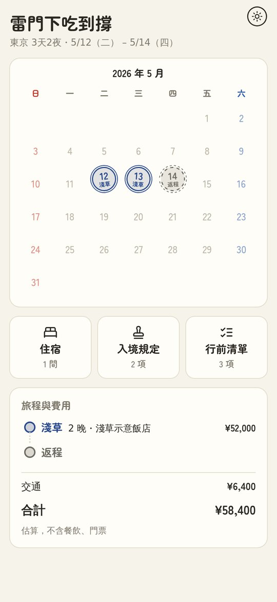
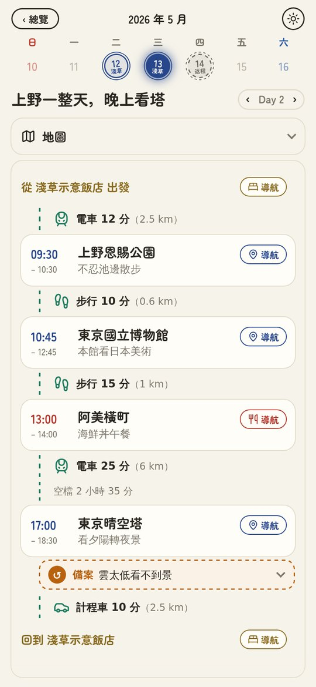
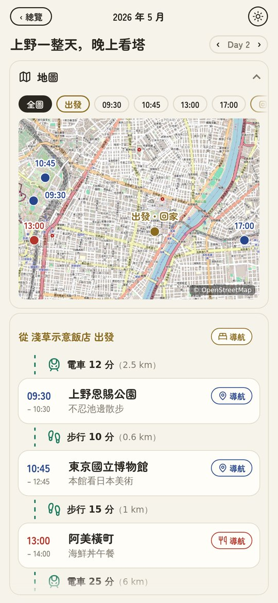
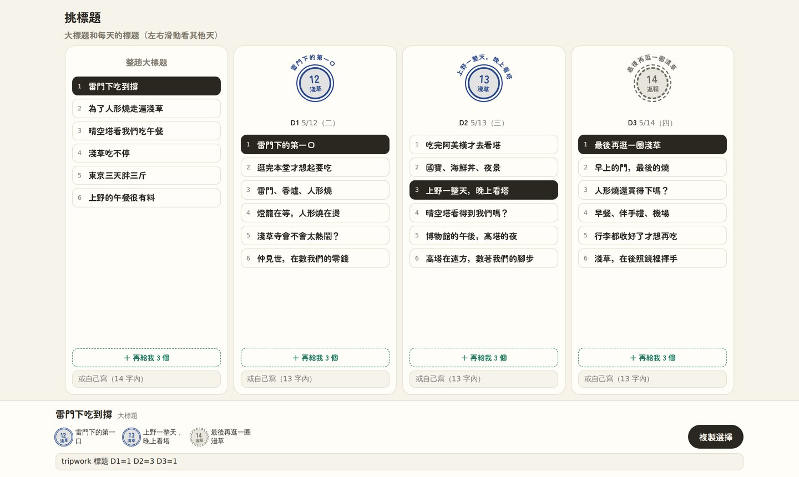
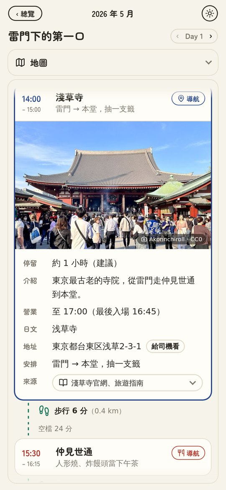
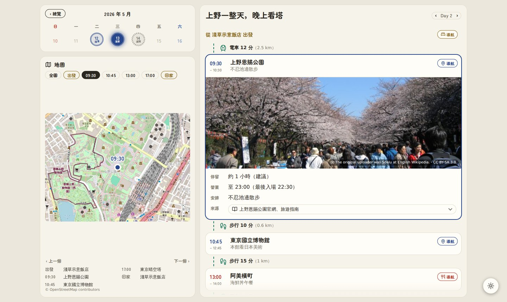

# tripwork

**用一句話請 Claude 排旅遊行程，拿到一份每個地點都查證過的行程：手機打開就能用，離線也能看。**

<p align="center">
  
  
  
</p>
<p align="center"><sub>示意行程：東京 3 天 2 夜（虛構的例子）。左起依序是首頁、每日行程、每日地圖。</sub></p>

tripwork 是 Claude Code 的外掛，你**不需要會寫程式**。它不憑印象排行程：每個景點、餐廳、住宿、營業時間和入境規定，
都要先找到 **2 個以上的獨立來源（至少 1 個是當地語言）**，而且**地圖座標要落在對的地方**，才會排進你的行程。
查不到的點不會偷偷放進來，你想去的點也不會被默默拿掉；遇到需要你決定的事，它一定會停下來問你。

目前版本見 [CHANGELOG.md](CHANGELOG.md)。

---

## 它幫你解決什麼痛點

| 自己排行程的麻煩 | tripwork 怎麼處理 |
|---|---|
| 查到的店其實已經關了 / 搬家了 | 每個地點都要 ≥2 來源交叉比對 + 地圖座標確認，查不到就不放進行程 |
| 行程一天跑東跑西、長輩累垮 | 自動把同一區的景點分群，跨區拉車太遠會**停下來問你**要不要換 |
| 餐廳要訂位卻不知道 | 自動列出「出發前要先訂」的清單，連前置天數一起標出來 |
| 排到當地紅字假日，人爆多或店家沒開 | 自動查出旅遊期間的**當地國定假日（含補假）**：閉館日不排那個點、假期/週末日標人潮提示並建議提早出門、錯開脆弱小店 |
| 排太晚到，撲空或被趕（過了 L.O./最後入場）| 每個排定時段都對**閉店/最後點餐/最後入場**算 buffer：來不及的時段不排、buffer 太緊會提醒提早，必去點塞不下會**停下來問你** |
| 行動電源、入境規定看不懂、又怕過期 | 規定一律找**官方來源**、標註生效日期，被禁的項目會醒目提醒並要你確認 |
| 搭計程車時司機看不懂中文店名 | 每站都附官方網站上的**當地語言地址**，一鍵全螢幕大字「給司機看」|
| 排好的行程要分享給家人很麻煩 | 一鍵輸出 Markdown（含地圖連結）、離線可看的一頁式 HTML（LINE 直接傳檔，可貼進 Notion）|
| 多點自駕每晚換鎮，住宿全空殼 | 每個過夜鎮都研究＋查證住宿（已訂的補料、沒訂的推薦你挑），顧到自駕車位、洗衣節奏、晚到 vs 櫃台關門 |
| 冬天自駕遇到道路封閉、雪鏈、天黑得早 | 用官方來源查季節/天氣危害：會擋路的（道路封閉）停下來問你，雪鏈／保暖寫進清單；自動算各鎮日落，摸黑開車的路段提醒你提早出發 |
| 多城行不知道搭哪班車、會不會趕不上末班車、Pass 划不划算 | 每段城際交通都查官方時刻：哪班車、要不要劃位、末班車幾點、Pass 划不划算；自駕單日開太久或趕不上末班車會停下來問你 |
| 不知道整趟大概多少錢、會不會超預算、Pass 划不划算 | 自動加總住宿＋城際交通＋Pass＋每日雜支，精算 Pass 划不划算，超出預算會停下來問你；全部誠實標為估算 |
| 帶長輩擠進尖峰電車、站走到景點太遠、不知道要不要買 IC 卡 | 查通勤尖峰時段（帶長輩/行李建議錯峰）、站到景點步行時間（太遠建議改計程車）、IC 卡怎麼買怎麼用，全寫進提醒 |

---

## 三步開始

**1. 安裝**：在 Claude Code 裡執行

```bash
claude plugin marketplace add git@github.com:helping-ai-workflow/tripwork.git
claude plugin install tripwork
```

需要 Claude Code（桌面 App、CLI、IDE 外掛都可以）。**不用申請任何 API key**：查證用 Claude Code 內建的網路搜尋，
地圖座標用免費的 OpenStreetMap。

**2. 用一句話描述你的旅程**（裝好後開一個新對話）

```
用 tripwork 幫我排 3 天 2 夜東京自由行，有長輩，想去淺草寺和阿美橫町。
```

其他例子：`用 tripwork 排京都 2 天，想去伏見稲荷和嵐山竹林。`／`用 tripwork 排沖繩家庭旅遊 4 天，有小孩，想要有海邊。`

**3. 回答它的問題，挑標題**

它會反問還缺的資訊（日期、住哪、必去的點、預算、同行的人），照實回答就好；查證、分區、排程、輸出都由它完成。
最後它會給你幾個搞笑的行程標題、每天 6 句小標題，打開「挑標題」網頁一次挑完，按「複製選擇」貼回對話。

<p align="center"></p>

**更新到新版：**

```bash
claude plugin marketplace update tripwork && claude plugin install tripwork
```

<details>
<summary>其他 AI agent 安裝（Cursor / Codex / Kimi / Gemini / OpenCode / Pi）</summary>

| Agent | 安裝 |
|---|---|
| Cursor / Codex / Kimi | 用各自的 plugin marketplace 加 `git@github.com:helping-ai-workflow/tripwork.git`，再 install `tripwork` |
| Gemini CLI | `gemini extensions install https://github.com/helping-ai-workflow/tripwork` |
| OpenCode | `opencode.json` 的 `plugin` 陣列加 `"tripwork@git+https://github.com/helping-ai-workflow/tripwork.git"`（見 `.opencode/INSTALL.md`） |
| Pi | `pi install git:github.com/helping-ai-workflow/tripwork` |

每個 agent 都會在 session 開始自動載入 `using-tripwork`，行為與 Claude Code 一致。
</details>

---

## 你會拿到什麼

成品放在行程資料夾最上層，檔名就是「出發日 短名 天數」，例如 `2026-05-12 東京 3天2夜.html`（還有同名的 `.md`）。

### 手機：一頁式 HTML，一個檔案就是整趟行程

用 LINE 傳檔、或放進 iPhone「檔案」App，點開就能看，**不用網路**（字型、圖示、地圖都包在檔案裡）。

<p align="center">
  
  
</p>

- **首頁**：你挑的搞笑標題、**紀念章月曆**（點哪天就進哪天），住宿／入境規定／行前清單三個按鈕，加上旅程與費用。
- **每天一頁**：從飯店出發、一站接一站、最後回到飯店，**每段都寫怎麼移動、幾分鐘、多遠**；備案就掛在它對應的那一站底下。
- **點一站才展開**：照片、介紹、營業時間、**當地語言的地址**、來源；按「**給司機看**」就用全螢幕大字顯示店名和地址，直接把手機拿給計程車司機。
- **好單手操作**：往上滑時，小月曆會先收起來，留更多空間給行程；標題旁的「‹ Day 2 ›」直接換天。
- **每天一張地圖**：點時間膠囊就跳到那一站的近景，點圖放大，也可以按「在 Google Maps 開這裡」看即時地圖；每一站都有導航鈕。
- 淺色為主，右上角可以切成深色。

### 電腦：同一個檔案，變成大螢幕儀表板

<p align="center"></p>
<p align="center"></p>

首頁是放大的紀念章月曆，每枚印章外圈寫著當天的主題；點一天就進入儀表板，左邊是月曆和地圖，右邊是當天行程，點哪一站地圖就跟著跳過去。

### 其他也一起交給你

- **Markdown 行程**：地點名稱本身就是 Google Maps 連結（用當地語言店名，搭車導航最準），移動列附路線導航；可以直接貼進 Notion。
- **行前清單**：要先訂位、先辦的事（含前置天數），以及這個季節要帶的東西。
- **住宿、城際交通、費用估算**：每個過夜鎮一家查證過的旅館；每段城際交通搭哪班車、末班車幾點、Pass 划不划算；整趟花費加總對照你的預算（都標明是估算）。
- **景點照片（選用，預設不開）**：只收授權清楚的照片（Wikimedia Commons、Openverse 等），一定標出作者與授權。

---

## 招牌規則：先查證，再排進行程

> 沒有任何景點、餐廳、地址、營業時間或規定，能在「**仍在營業** ＋ 通過 ≥2 個獨立來源交叉比對（至少 1 個當地語言）
> ＋ 地圖座標落在它聲稱的區域（且查到的就是它本人）」之前，被寫進你的行程。

沒通過的地點**不會被偷偷丟掉**：它們會被記下來，並標明原因（已歇業、來源不足、查到的是別家店、座標跑到別區……），讓你看得到、自己決定。

### 它什麼時候會停下來問你

- **你的選擇**：行程和每天的標題、還沒訂住宿的鎮要住哪一家
- **來源打架**：不同來源對同一個點的營業時間、地址講法不一樣
- **排不進去**：必去的點剛好公休、任何時段都來不及、或找不到查證過的點
- **太遠太累**：跨區移動超過上限、自駕單日開太久、會趕不上末班車
- **規定與安全**：某項物品被禁止、道路在你的旅遊期間封閉、旅館缺你需要的設施
- **超出預算**：估算總額超過你設定的預算

你回答過的問題會被記下來，**同一件事不會問你第二次**。

<details>
<summary>完整清單</summary>

- 行程的**搞笑標題**：先給你六個不同路數的候選 → 你挑一個或自己寫
- **每天的標題**：每天給你 6 句（押韻的旁邊標注音韻腳，例如「ㄝ韻」），打開「挑標題」網頁一次挑完、按「複製選擇」貼回對話（大標題也能在這裡再換一次）；不想用網頁也能直接回號碼，例如 `D1=3 D2=1`。都不喜歡就按「再給我 3 個」，或自己寫
- 不同來源對同一個點**講法矛盾**（評分／營業時間／地址不一致）→ 問你信哪個
- 某個跨區移動**太遠**（超過你設定的上限，預設 60 分）→ 問你要保留還是換點
- 某個跨區移動的**預估時間不合理**（比實際距離所需的最短時間還短，例如硬說走路 10 分鐘能到 10 公里外）→ 停下來要你補一個真的來源（路線引擎查詢或時刻表），不會自己把猜測的數字往上調就蒙混過關
- 某家餐廳的**訂位時間來不及** → 提醒你
- 某項規定是**被禁止**的（例如某類行動電源）→ 要你明確確認
- 你**指定必去**的點，在所有可行日都**剛好公休** → 停下來問你怎麼調
- 你**指定必去**的點，**任何時段都來不及**在閉店/最後入場前完成 → 停下來問你怎麼調
- 你**指定必去**的點驗證失敗 → 直接告訴你，不會默默拿掉
- 你**指定必去**的主題，找不到任何查證過的點可以排 → 停下來問你
- **國定假日**剛好落在你指定必去的點唯一能去的那天，而那天它公休 → 停下來問你
- 某個過夜鎮你**還沒訂住宿** → 推薦 3 家查證過的讓你挑
- 你訂的旅館**缺必備設施**（例如自駕沒車位） → 停下來問你換不換
- 你訂的旅館**地圖座標落在別的鎮** → 停下來問你
- 你訂的旅館**名字或座標查不到可信來源、或營業狀態沒有來源與日期** → 跟景點用同一套查證標準（含「還在營業」這一項），查不到來源一樣視為未驗證並提醒你
- 景點或住宿的「已驗證」其實是**用舊規則判定出來的**（例如營業狀態只是隨口打勾、沒有查證來源與日期）→ 品質關卡會擋下來，自動導回去補查證，不會讓過時的驗證結果矇混過關
- 開車當天**晚於旅館櫃台關門**又沒 late check-in → 停下來提醒你
- 某段路在你的旅遊期間**官方公告封閉**（例如雪季的高山公路） → 停下來問你怎麼調
- 冬天某段車程預計**天黑後才到** → 提醒你那天提早出發（不擋流程）
- 某段城際交通你會**趕不上末班車** → 停下來問你（提早出發／改隔天／換交通方式）
- 某段自駕**單日開太久**（超過你設定的上限，預設 5 小時） → 停下來建議你拆兩天
- 估算總額**超出你設定的預算** → 停下來問你（刪減／降級某項，或接受）
- 匯出前的檢查發現**資料本身有缺**（例如照片沒標作者授權、要訂位的點沒有官方來源），重新產生也修不好 → 停下來請你補資料，不會一直重產
- 你回答過的問題會被記下來，**同一件事不會問你第二次**
- 用**比較舊的行程資料夾**接續排（例如中途換過版本、缺了路線／交通／花費檔案）→ 輸出前的品質關卡現在會直接擋下來，不會像以前一樣默默放行；系統會自動導回該補的那一站幫你重新查（路線／交通／花費），不用你自己猜要重跑哪一步

</details>

---

## 常見問題

**要付費或申請 API key 嗎？**
不用。地圖座標用免費的 OpenStreetMap Nominatim；網路搜尋用 Claude Code 內建功能。

**它會不會自己亂編地點？**
不會。沒通過查證關卡的地點進不了行程，且會被標明原因留存，不會假裝成「已驗證」。

**支援哪些目的地？**
任何地方都可以——只要該地點在網路上有 ≥2 個來源、且地圖查得到座標。會自動用
當地語言搜尋，所以日本、韓國、東南亞等地的在地小店也涵蓋得到。

**怎麼放進 Notion？**
把產好的 Markdown 行程貼進 Notion 頁面就好（透過你環境的 Notion MCP）。Notion 不是獨立的輸出步驟，貼的就是那份已驗證的 Markdown。

**更新到 1.0 之後，舊的行程怎麼辦？**
下次請它繼續舊行程時，它會先停下來，請你同意把舊資料搬進行程資料夾裡的資料子資料夾（只搬位置、不改內容），
接著補上新版需要的東西——例如每天一句短主題、讓你挑的搞笑標題、住宿所在地區——再重新產出成品。

**我可以中途改需求嗎？**
可以。每個階段的產物都是檔案，調度中心會從你改動的地方接續往下跑，不用整個重來。

---

## 開發者資訊

<details>
<summary><b>完整流程：每一步在做什麼</b></summary>

tripwork 不是一次把行程「生」出來，而是一條**有關卡的流水線**：每一步只做一件事，
做完回到調度中心（orchestrator）決定下一步。這樣每個地點都被獨立查證，錯誤無法一路矇混到最後。


```mermaid
%%{init: {'flowchart':{'htmlLabels':true}}}%%
flowchart TB
    P["✍️ 你的一句話需求"]
    P --> WSP["workspace-shape-preflight<br/>確認工作資料夾"]
    WSP --> ORC["orchestrator<br/>調度中心"]
    ORC --> TB["trip-brief<br/>把需求整理成參數"]
    TB --> ADV["travel-advisory ⛔ 關卡<br/>入境／海關<br/>／行動電源規定<br/>（官方來源）"]
    ADV --> DR["destination-research<br/>廣泛蒐集候選地點<br/>（含當地語言搜尋）"]
    DR --> SV["source-verify ⛔ 關卡<br/>≥2 來源 + 地圖座標<br/>+ 區域比對"]
    SV --> RA["routing-audit<br/>同區分群<br/>算跨區拉車時間"]
    RA --> ACC["accommodation-research<br/>每個過夜鎮研究<br/>+ 查證住宿<br/>（設施/車位/洗衣）"]
    ACC --> LEG["inter-stop-legs<br/>城際交通<br/>（哪班車/末班車/Pass<br/>自駕單日車程）"]
    LEG --> CAL["calendar-check<br/>查旅遊期間當地假日<br/>（含補假）"]
    CAL --> SEA["seasonal-advisory<br/>查季節/天氣危害<br/>（道路封閉、雪鏈、日照）"]
    SEA --> TRN["transit-detail<br/>市內交通<br/>（尖峰時段/IC卡<br/>站到景點步行）"]
    TRN --> COST["cost-rollup<br/>加總住宿/交通/Pass<br/>+ 雜支，對照預算"]
    COST --> SYN["itinerary-synthesis<br/>排出逐日行程<br/>+ 備案 + 行前清單<br/>（閉館日不排、<br/>假期標人潮）"]
    SYN --> GATE["itinerary-gate<br/>輸出前的結構檢查<br/>+ 重算核對資料<br/>+ 語氣檢查<br/>+ 住宿查證"]
    GATE --> EXP["export-artifact<br/>Markdown / Maps<br/>HTML"]
    EXP --> EGATE["export-gate ⛔ 關卡<br/>檢查成品連結<br/>格式可正常顯示"]
```

白話版每一步：

| 步驟 | 它在做什麼 |
|---|---|
| **trip-brief** | 把你說的話整理成日期、住宿、必去清單、預算、成員等參數；也會幫行程取短名（檔名用）和六個搞笑標題讓你挑 |
| **travel-advisory** ⛔ | 查入境、海關、行動電源等**硬規定**，一律要官方來源並標生效日期；被禁項目醒目提醒並寫進行前清單（在蒐集景點前先確認，被禁項目不會浪費後面的研究） |
| **destination-research** | 廣泛上網蒐集候選景點／餐廳（**會用當地語言搜尋**，挖出國際網站漏掉的店）。此階段先不信任，只是蒐集 |
| **source-verify** ⛔ | **招牌關卡**。每個候選地點要：①**還在營業**（永久／暫停營業的會被擋掉；營業狀態一定要附**查證來源與日期**，不是憑印象打勾就算——查不到有來源根據的營業狀態一樣標未驗證、不放進行程）②≥2 個獨立來源（至少 1 個當地語言）③地圖能查到座標、且查到的就是它本人（被改名的鄰店會被擋）④座標落在它聲稱的區域內（拿來比對的區域中心點若查到別的地方會被拒用，不會拿錯的點來比）、**且座標的來源要記錄下來**（沒記來源一樣視為未驗證，不會因為漏填就矇混過關）。全部過才算「已驗證」，才能進行程 |
| **routing-audit** | 把已驗證地點按「區」分群，估算跨區移動時間；太遠（預設 >60 分）會**停下來問你** |
| **accommodation-research** | 每個過夜鎮研究／查證住宿：已訂的查證+補料，沒訂的推薦 3 家讓你挑；查不到座標用該鎮中心 fallback（免 API key）；確認車位（必備硬擋）、洗衣節奏（軟提示）、晚到 vs 櫃台關門；日文假名旅館名附中文對照 |
| **inter-stop-legs** | 規劃過夜城市之間的**城際交通**：大眾運輸查哪班車、要不要劃位、轉乘幾次、**末班車**幾點、要不要買 Pass；自駕和計程車算車程，**單日開太久**會停下來建議拆兩天。趕不上末班車也會停下來問你 |
| **calendar-check** | 用官方來源查出旅遊期間的**當地國定假日（含補假）**，標好哪幾天人潮／店家可能受影響 |
| **seasonal-advisory** | 查旅遊期間的**季節/天氣危害**（用官方來源：道路狀況、氣象、高山警告）：道路封閉這種會擋路的會停下來問你，雪鏈／保暖／日照短這種寫進行前清單；冬天自駕還會算每個鎮的日落時間，提醒哪段會摸黑開車要早點出發 |
| **transit-detail** | 查市內交通的**舒適度細節**：通勤**尖峰時段**（帶長輩/行李避開人擠人；只在它適用的平日與地區提醒，週末或別的城市不會誤報）、**IC 卡**（Suica/ICOCA 等，哪買怎麼儲值）、每個景點**從車站走過去要幾分鐘**（太遠提醒改計程車）。全是提醒，不擋流程 |
| **cost-rollup** | 把**大宗花費**加總給你看：住宿（每晚×**房數**×晚數）、城際交通、交通 Pass，外加你給的每日雜支估值；精算 **Pass 到底划不划算**；有設預算的話，**超出會停下來問你**（預算對照的是整趟總額：住宿＋交通＋雜支）。全部標明是估算（含查詢日期），不是精確報價 |
| **itinerary-synthesis** | 排出逐日時段表，幫帶長輩／小孩的人把同區行程排在一起省體力；**閉館日不排該點、假期/週末標人潮並建議提早出門、過了閉店/L.O./最後入場的時段不排**；自動產生**備案**與**行前訂位清單**；每天寫 **6 個標題候選**（有畫面、有梗、押韻照台灣讀音），用「挑標題」網頁讓你挑 |
| **itinerary-gate** | 輸出前做機械式結構檢查（餐廳、活動、景點都有對應到驗證過的地點）。**現在還會**：①把路線時間、花費、關店 buffer 這些數字**重新算一遍**，跟行程裡記錄的核對是否一致，兜不起來就擋下來 ②檢查文案**有沒有 AI 罐頭味**（例如「首選必訪」這種空話、破折號濫用）③連**住宿**的查證狀態（名字有沒有對到、座標有沒有查證來源）也一起核對，不再只查景點 ④**景點與住宿的「已驗證」是不是用現在還算數的規則判定的**——例如營業狀態只是隨口打勾、沒有查證來源與日期，就算當初有記錄，現在也會被判定過時、擋下來重新查證 ⑤為新版閱讀器把關資料：每天從住宿出發、一站接一站、最後回到住宿，每一段都要寫清楚怎麼移動、多久、多遠（估算的會用兩站座標重算一次）；每一站都必須是查證過的地點；備案要掛在它對應的那一站；每天要有一句短主題；行前清單要分好「預約／出發前確認／打包」；來源要附網站名稱與說明；住宿要有地區短名；行程要有短名與你選定的搞笑標題 |
| **export-artifact** | 產出成品：Markdown 行程（附 Google Maps 連結）、離線可看的一頁式 HTML（放在行程資料夾最上層，例：`2026-05-12 東京 3天2夜.html`，每天附一張地圖，**可選擇為景點疊上授權照片**——照片來源現在全程都會過一次授權檢查才寫入成品，不會有漏網的來路不明照片；可把 Markdown 貼進 Notion）|
| **export-gate** | 對輸出的成品做最後機械檢查（HTML 另查：離線可看、沒有來路不明的程式碼、授權與地圖出處都標了）：每個地點名稱本身是可點連結、**每個 Google Maps 連結都能正常打開（擋掉會失效、打不開的地圖連結）**、要訂的項目附官方來源連結、金額不會把預覽弄壞（不殘留裸 `$`）；有問題就退回重產 |

</details>

<details>
<summary><b>實測範例：東京與京都</b></summary>

下面兩個案例是用 tripwork 的查證／路線邏輯，搭配**即時地圖座標**實際跑出來的，
用來證明流程會產出合理的行程、而且關卡真的會擋。

### 案例 A — 東京 3 天 2 夜（帶長輩，住淺草）

5 個候選地點全部成功查到座標、且落在正確的區（台東区）：

| 地點 | 區域 | 座標查證 |
|---|---|---|
| 浅草寺 | 淺草 | ✅ 35.713, 139.796 |
| 仲見世通り | 淺草 | ✅ 35.713, 139.797 |
| 上野恩賜公園 | 上野 | ✅ 35.715, 139.774 |
| 東京国立博物館 | 上野 | ✅ 35.719, 139.776 |
| アメ横（阿美橫町） | 上野 | ✅ 35.710, 139.775 |

- 淺草 ↔ 上野直線僅 **1.97 km**，地鐵約 15 分 → 判定 `ok`。
- 分成「淺草日」與「上野日」兩群，**同區排在一起**，帶長輩不用來回拉車 → 合理。

### 案例 B — 京都 2 天（伏見稲荷 + 嵐山竹林）

關卡如預期觸發：

- 伏見稲荷 ↔ 嵐山直線 **11.30 km**，搭 JR 需在京都站轉車，門到門實測約 **65 分**
  → 超過 60 分上限，判定 `far` → **tripwork 會停下來問你**要不要保留兩點或調整，
  不會默默排一個讓你當天疲於奔命的行程。✅ 安全機制有效。
- 另外發現一個實用細節：地圖查座標要用**當地語言店名**（`渡月橋` 查得到、
  英文 `Togetsukyo Bridge` 加了 "Bridge" 反而查不到）。tripwork 的 export 與查證
  都以當地語言店名為準，正是為此。

> 結論：流程跑得通，行程合理，且「太遠就停下來問」的安全閥確實會作動。

</details>

<details>
<summary><b>本機開發與測試</b></summary>

```bash
python3 -m venv .venv && . .venv/bin/activate   # Ubuntu 23.04 起不讓 pip 直接裝進系統 Python
pip install -e ".[dev]"
pytest                    # 單元與端到端測試（CI 每個 PR 都跑）

# 閱讀器的互動量測（headless Chromium + WebKit；CI 另一個 workflow，改到閱讀器、字型、圖示時才跑）
pip install -e ".[dev,browser]" && python -m playwright install chromium webkit
sudo .venv/bin/python -m playwright install-deps chromium webkit   # 系統函式庫（apt，要輸入密碼）
python -m pytest tests_browser
```

完整的新機器設定與常見錯誤見 `CLAUDE.md` 的 Dev environment。

**程式在哪裡**

- **流水線**：`skills/` 下有 18 個 skill：16 個流水線步驟、調度中心 `orchestrator`，以及給 agent 看的入口 `using-tripwork`；純邏輯在 `scripts/`（都有單元測試），schema 在 `schemas/`，端到端 fixture 在 `tests/`。
- **CLI**：`python scripts/validate_artifact.py trips/<slug>/data/<artifact>.yaml` 驗 schema；`python scripts/gate.py trips/<slug>`、`python scripts/export_gate.py trips/<slug>` 跑關卡並寫 report；`python scripts/next_stage.py trips/<slug> --work-dir work/<slug>` 印出下一站。exit code：0 pass／1 fail／2 用法錯。
- **HTML 閱讀器**：`scripts/render/reader/`。手機版全程純 CSS 與頁內錨點（LINE、iPhone「檔案」的預覽不跑 JavaScript）；電腦版（≥1024px）用同一份 DOM 重排成大月曆首頁與每日儀表板。唯一一段 script 是 `centre.py::CENTRE_JS`（電腦版把跳到的那站置中），`export-gate` 以 sha256 比對放行。每張圖在頁面裡只內嵌一次。
- **每日地圖（選用）**：`pip install -e '.[maps]'` 後跑 `python scripts/day_maps.py trips/<slug>`，從 OpenStreetMap 圖磚產生 `data/day-maps.yaml`（快取在 `work/<slug>/tile-cache/`、每秒最多一次請求、User-Agent 只有程式名與 repo 網址）；沒跑就畫示意方格。
- **景點照片（選用）**：`scripts/photo_adapter.py`（backend `none`（預設）／`wiki`／`google`），授權白名單 `{CC0, PD, CC-BY, CC-BY-SA}`。照片存在側檔 `verified-pois-media.yaml`，輸出時由 `scripts/media_merge.py` 疊回去。`google` 來源因 ToS 標為不可散布（`export-gate` 會標 `distributable: false`）。
- **每日標題**：規則在 `scripts/day_titles.py`；押韻以**台灣讀音**判斷，讀教育部《國語小字典》（原檔不修改，放在 `assets/dict/moe-mini/`，由 `scripts/zhuyin.py` 讀）；挑選頁 `scripts/title_picker.py`，回覆解析 `scripts/title_picks.py`。
- **樣式看板**：`python scripts/design_board.py board.yaml` 把要讓使用者選的樣式做成一頁離線 HTML（放在不進版控的 `.design-board/`），每張卡片標代號，按「複製選擇」得到一行文字貼回任何 AI agent；規則見 `CLAUDE.md` 的 Visual work。
- **隱私**：這個 repo 不放任何真實行程；範例、測試資料、截圖都是虛構的。`tests/test_privacy.py` 會擋下工作區檔案、白名單外的圖片與 email，有工作區時也會比對每趟行程的代號、旅館、成員、住處與未來日期；規則見 `CLAUDE.md` 的 Privacy。
- **資料夾結構**：
  ```
  trips/<slug>/
  ├── 2026-05-12 東京 3天2夜.html   ← 成品（.md 同名）
  └── data/                          ← 所有 yaml、照片側檔、原始 PDF
  work/<slug>/                       ← gate-report / export-gate-report / stage-state / geocode 快取
  ```
  路徑一律由 `scripts/paths.py` 決定。舊版行程（資料檔放在 `trips/<slug>/` 最上層）先跑
  `python scripts/migrate_v1.py trips` 看 dry run，再加 `--apply`；不會刪任何檔。

**地圖座標用量限制**：使用 OSM Nominatim（免 API key），請遵守它的使用政策（≤ 1 req/s、帶 User-Agent）。
`scripts/geocode.py` 已設好 User-Agent，呼叫端負責節流；每趟行程的查詢會快取在 `work/<slug>/geocode-cache/`。

每一版改了什麼、為什麼改、量到什麼，見 [CHANGELOG.md](CHANGELOG.md)。

</details>

## 授權

## 授權

[MIT](LICENSE)

台灣讀音資料：中華民國教育部（Ministry of Education, R.O.C.）。《國語小字典》（版本編號：2019_20260929）網址：http://dict.mini.moe.edu.tw/ ——採 CC BY-ND 3.0 TW 授權，原檔不修改收錄於 `assets/dict/moe-mini/`（含教育部使用說明，見該處 `SOURCE.md`）。
